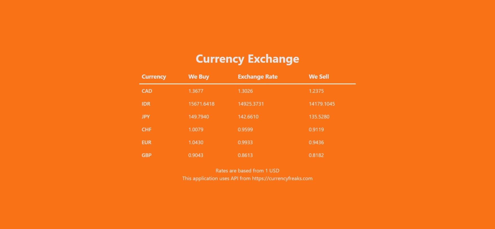

# Assignment Project: Display Currency Rates

**Nama : Muhammad Fadil Ardiansyah**
**Student Code : RCTN-KS04-020**

Objective:  Create your React App for Project Currency Rates

### Requirements
Membuat sebuah aplikasi dengan React untuk menampilkan rate dari mata uang berikut:
- CAD
- IDR
- JPY
- CHF
- EUR
- GBP

### Steps

- Menggunakan third party API [CurrencyFreaks](https://www.currencyfreaks.com/)
- Base mata uang menggunakan United States Dollar (USD)
- Menambahkan kolom-kolom logic business berikut untuk pertukaran mata uang:
  - Currency - nama dari mata uang
  - We Buy - harga mata uang yang akan dibeli
  - Exchange Rate - nilai tukar mata uang
  - We Sell - harga mata uang yang akan dijual

Berdasarkan rate yang didapat pada 3rd party API, membuat bussines logic untuk menampilkan mata uang berdasarkan nilai 1 USD.

## Hasil Akhir

#### Screenshoot

